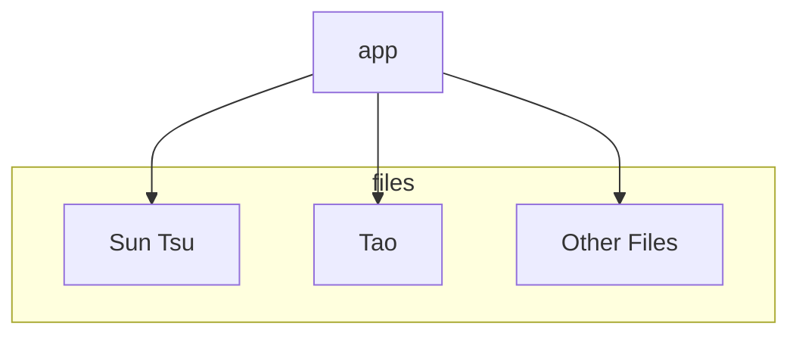

# Daily Wisdom

Get your wisdom here! This was a short personal project I had to send myself
messages such as sun tsu, the tao of programming, etc to my slack channel daily.
I felt that these pieces of literature were best served like a cup of coffee,
daily and gradually, rather than all at once.


Honestly, this repo is currently scoped mainly to just work ( and it does ) for
my personal use. If this is interesting to others, I would be happy to build out
a more production version of this.

**State:** Works, but made for personal use. You can extend this and generalize
it, but not built for a larger audience.

## Usage:

To start with python:

```
python -m pip install -r requirements.txt
cd app && python main.py
```

To start with docker: `docker-compose up -d>`

## Environment Variables

- **DATAFILE**: Should point to the files.json file. It's relative to where you
  invoke the script.

## Swagger Docs

You can go to `/docs` for swagger docs. Ex. http://127.0.0.1:5000/docs

### /{key} api

You can extend and add your own namespaces. For example, extend this into your
own books etc. It will be keyed based upon the `files.json` file.

The content should be in yml format. See [sun tsu](app/sun_tsu.yml) for more
details.

## Ways to integrate this into slack

I have daily messages sent to slack via a scheduler.


But you can customize this to whatever you want. As a command:


or many others.

See https://api.slack.com/messaging/webhooks for documentation on how to use
incoming web hooks.

## Architecture

super simple architecture



## Contributions

I'd welcome contributions! PR's, Issues, etc!
