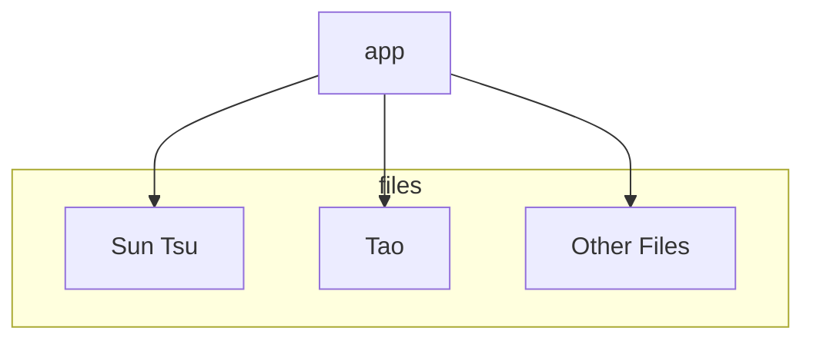

# Daily Wisdom

Get your daily wisdom here! I will improve the documentation on this README shortly. This was mostly for personal use so never bothered to improve the documentation on the README. 

## Usage:

To start with python: 
```
python -m pip install -r requirements.txt
python main.py
```

To start with docker: `docker-compose up -d>`

Uses fast api. 

## Installing via slack: 

In your slack, https://api.slack.com/messaging/webhooks

## Architecture

super simple architecture


